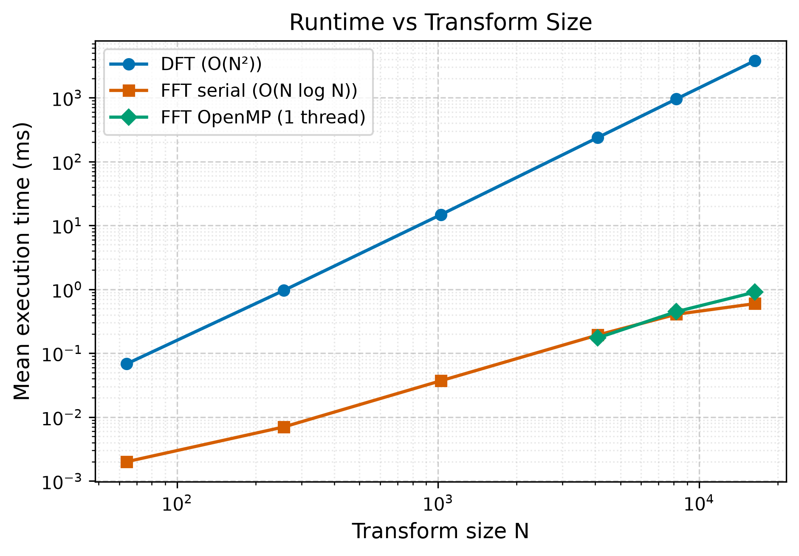
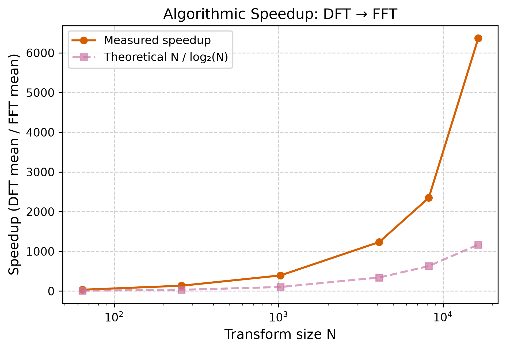
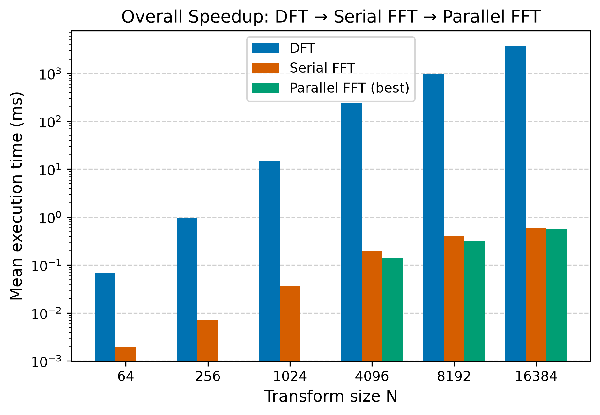
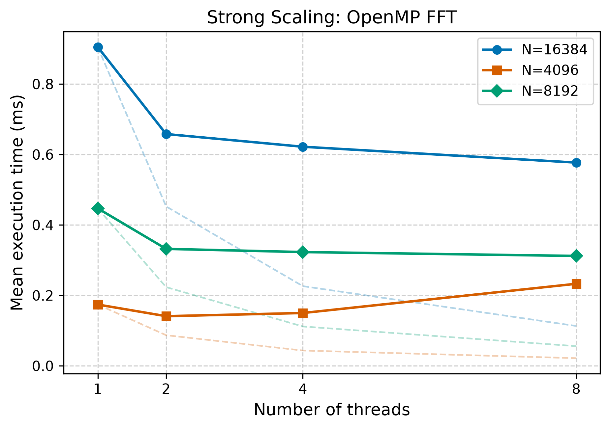
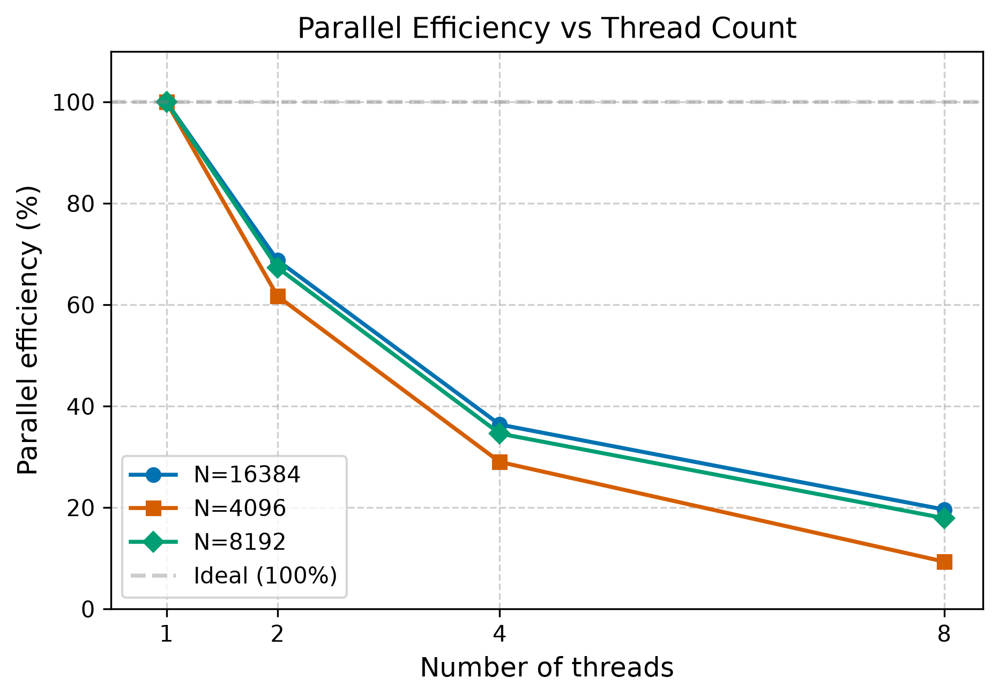

# High-Performance Parallel FFT Engine

A C++ project that implements the Fast Fourier Transform from scratch, then progressively optimizes it using OpenMP while measuring and analyzing the performance improvements.

**Platform:** Windows · MSVC 2022 · OpenMP · Intel Core i7-9700 (8 cores) · 16 GB RAM

---

## Why I built this

I wanted to understand how algorithmic optimization and parallel programming affect real performance. Rather than using an existing FFT library, I implemented the algorithm from scratch, verified its correctness, benchmarked it, and analyzed the results.

The project builds up in stages — starting with a naive DFT, then a serial FFT, then an OpenMP parallel version — so each optimization can be measured independently. This approach demonstrates systematic performance engineering that applies beyond FFT specifically.

---

## What I implemented

- **Naive DFT.** A direct implementation of the Discrete Fourier Transform (O(N²)). Serves as a correctness reference and baseline for speedup calculations.
- **Iterative radix-2 FFT.** The Cooley-Tukey Fast Fourier Transform (O(N log N)). Uses bit-reversal permutation, precomputed twiddle factors, and in-place butterfly operations.
- **OpenMP parallel FFT.** The butterfly computation is parallelized across CPU cores using OpenMP. Bit-reversal and twiddle precomputation remain serial where appropriate.
- **Benchmark suite.** Three separate benchmarks measure algorithmic speedup (DFT vs FFT) and strong scaling (OpenMP across 1–8 threads).
- **Python plotting automation.** Scripts run all benchmarks and generate publication-quality figures from the output.

---

## Architecture

```
   Input Signal
        |
        v
   Naive DFT ------> Numerical Baseline (O(N^2))
        |
        v
   Serial FFT ------> Algorithmic Speedup (O(N log N))
        |
        v
   OpenMP FFT ------> Parallel Speedup (8 threads)
        |
        v
   Benchmarking ----> Strong-Scaling Analysis
        |
        v
   Python Plots ----> Report Figures
```

---

## Project Structure

```
├── CMakeLists.txt
├── README.md
├── include/          Header files
├── src/              Implementation
├── benchmark/        Benchmark programs
├── test/             Correctness tests
├── tools/            Python automation scripts
└── results/figures/  Generated PNG figures
```

---

## Build Instructions

### Prerequisites

- CMake ≥ 3.15
- C++17 compiler with OpenMP support
  - Windows: Visual Studio 2022 with OpenMP
  - Linux: GCC or Clang with `-fopenmp`

### Configure and Build (Release)

```bash
# Windows (x64)
cmake -B build -G "Visual Studio 17 2022" -A x64
cmake --build build --config Release

# Linux
cmake -B build -DCMAKE_BUILD_TYPE=Release
cmake --build build
```

---

## Running Tests

All 62 correctness tests must pass.

```bash
# DFT correctness — 6 tests
./build/Release/test_dft

# FFT correctness (serial) — 12 tests
./build/Release/test_fft

# OpenMP FFT correctness — 44 tests
./build/Release/test_fft_openmp
```

---

## Running Benchmarks

```bash
# Algorithmic speedup: DFT vs serial FFT
./build/Release/benchmark_compare

# OpenMP strong-scaling analysis
./build/Release/benchmark_strong_scaling

# Standalone DFT benchmark
./build/Release/benchmark_dft
```

---

## Running the Python Plotting Scripts

```bash
pip install -r tools/requirements.txt
python tools/plotting.py
python tools/plotting.py --no-run   # re-plot from cached data
```

Figures are saved to `results/figures/` as 300 DPI PNG.

---

## Benchmark Highlights

| Metric | Result |
|---|---|
| Algorithmic speedup (DFT → FFT, N=16,384) | ~7,000× |
| Best parallel speedup (OpenMP, 8 threads) | ~2.1× |
| OpenMP 1-thread overhead vs serial FFT | 37–48% |
| Strong-scaling efficiency (2 threads) | ~71% |
| Strong-scaling efficiency (8 threads) | ~27% |
| Correctness tests passing | 62 / 62 |

### Runtime vs Transform Size



The DFT time grows by roughly 4× when N doubles (O(N²)), while the FFT grows by roughly 2× (O(N log N)). At N=16,384, the serial FFT completes in ~0.54 ms — over 7,000× faster than the DFT.

### Algorithmic Speedup



The measured speedup exceeds the N/log₂(N) ratio because the DFT evaluates many expensive sine and cosine calculations per transform, while the FFT precomputes twiddle factors once.

### Overall Speedup



Algorithmic optimization (O(N²) → O(N log N)) produces orders of magnitude more speedup than parallelization alone.

### Strong Scaling



Dashed lines show ideal scaling. The OpenMP FFT performs best at larger problem sizes where there is more work per thread to offset synchronization costs.

### Parallel Efficiency



Efficiency drops from ~100% at 1 thread to ~22–27% at 8 threads, consistent with barrier synchronization overhead, OpenMP runtime costs, and limited work per thread.

---

## Design Decisions

- **Persistent parallel region.** A single `#pragma omp parallel` block encloses all FFT stages rather than creating a new region per stage. This avoids repeatedly creating and destroying threads.
- **Static scheduling.** Each butterfly does similar work, so static scheduling distributes them evenly with negligible overhead.
- **Serial twiddle precomputation.** Twiddle factors are computed by one thread to avoid redundant work across threads.
- **Kernel-only timing.** Only the transform itself is timed — signal generation and output processing are excluded.
- **Statistical aggregation.** Each configuration runs 10 times; min, mean, median, and max are reported for reliable comparison.

---

## What I Learned

- Choosing a better algorithm usually provides a much larger speedup than parallelization. The O(N²) → O(N log N) improvement alone gave ~7,000×.
- Parallel programming introduces real overhead — the OpenMP version was 37–48% slower than serial when running on a single thread.
- Synchronization costs limit scalability. Even though the butterfly computation is embarrassingly parallel, the barriers between stages create serialization.
- Good benchmarking requires careful methodology: warm-up runs, multiple iterations, and kernel-only timing all matter.
- Correctness should always be verified before measuring performance. The OpenMP version produces bit-identical results to the serial FFT across all tested configurations.

---

## Conclusions

This project gave me hands-on experience with algorithm design, OpenMP, benchmarking, and performance analysis. The biggest lesson was that improving the algorithm had a much larger impact than simply adding more threads.

The serial FFT outperforms the DFT by roughly 7,000× through algorithmic optimization alone. OpenMP provided additional speedup of about 2.2× on 8 cores, with diminishing returns from synchronization and overhead costs. The project is a concrete demonstration of systematic performance engineering — implement, measure, improve, and measure again.
